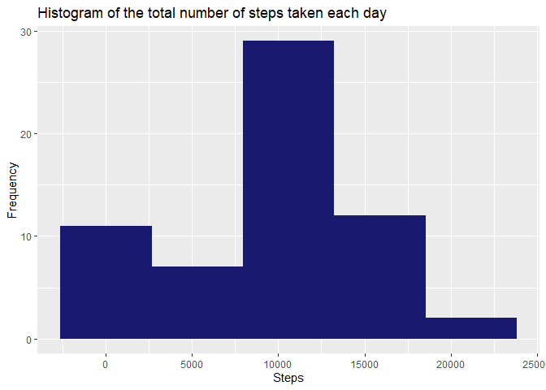
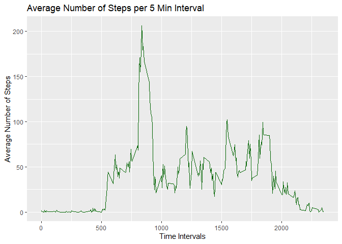
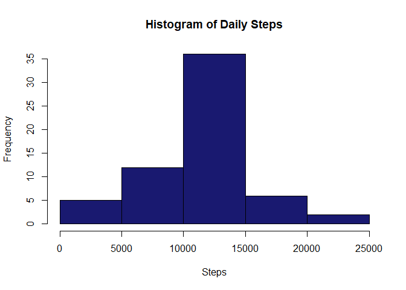
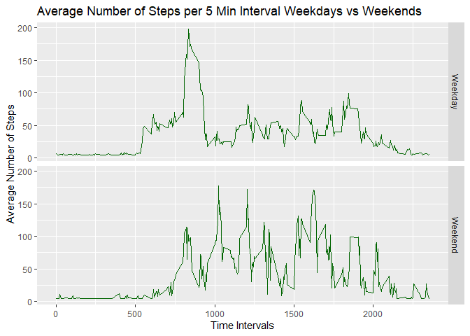

## Introduction
It is now possible to collect a large amount of data about personal
movement using activity monitoring devices such as a
[Fitbit](http://www.fitbit.com), [Nike
Fuelband](http://www.nike.com/us/en_us/c/nikeplus-fuelband), or
[Jawbone Up](https://jawbone.com/up). These type of devices are part of
the "quantified self" movement -- a group of enthusiasts who take
measurements about themselves regularly to improve their health, to
find patterns in their behavior, or because they are tech geeks. But
these data remain under-utilized both because the raw data are hard to
obtain and there is a lack of statistical methods and software for
processing and interpreting the data.

This assignment makes use of data from a personal activity monitoring
device. This device collects data at 5 minute intervals through out the
day. The data consists of two months of data from an anonymous
individual collected during the months of October and November, 2012
and include the number of steps taken in 5 minute intervals each day.


The data for this assignment can be downloaded from the course web
site:

* Dataset: [Activity monitoring data](https://d396qusza40orc.cloudfront.net/repdata%2Fdata%2Factivity.zip) [52K]

The variables included in this dataset are:

* **steps**: Number of steps taking in a 5-minute interval (missing
    values are coded as `NA`)

* **date**: The date on which the measurement was taken in YYYY-MM-DD
    format

* **interval**: Identifier for the 5-minute interval in which
    measurement was taken


The dataset is stored in a comma-separated-value (CSV) file and there
are a total of 17,568 observations in this
dataset.

The assignment will be constructed using R Studio Version 1.2.1335 on a Windows 10 machine.

## Packages
During our analysis in addition to the R standard packages we will use the packages included in the tidyverse suite (mainly readr, dplyr, ggplot2) and lubridate.

To install the package use the following command into R studio : "install.packages("tidyverse")" and choose where to install it.

Once installed load it into R:

```r
library(tidyverse)
```

```
## -- Attaching packages --------
```

```
## v ggplot2 3.2.0     v purrr   0.3.2
## v tibble  2.1.3     v dplyr   0.8.1
## v tidyr   0.8.3     v stringr 1.4.0
## v readr   1.3.1     v forcats 0.4.0
```

```
## -- Conflicts -----------------
## x dplyr::filter() masks stats::filter()
## x dplyr::lag()    masks stats::lag()
```

```r
library(lubridate)
```

```
## 
## Attaching package: 'lubridate'
```

```
## The following object is masked from 'package:base':
## 
##     date
```

## Loading and preprocessing the data
First we need to download the data provided for this assignment in the form of a zip file. We create a directory in the working directory of R (of your choice) and unzip that file.

```r
if(!file.exists("./data")){dir.create("./data")}
fileUrl <- "https://d396qusza40orc.cloudfront.net/repdata%2Fdata%2Factivity.zip"
download.file(fileUrl,destfile="./data/activity.zip",method="curl")

unzip(zipfile="./data/activity.zip",exdir="./data")
```

Finally we create the data table that will be used as our initial dataset.

```r
activity <- read_csv("./data/activity.csv")
```

```
## Parsed with column specification:
## cols(
##   steps = col_double(),
##   date = col_date(format = ""),
##   interval = col_double()
## )
```

```r
# Let's display a couple of row of the data table
head(activity, n=7)
```

```
## # A tibble: 7 x 3
##   steps date       interval
##   <dbl> <date>        <dbl>
## 1    NA 2012-10-01        0
## 2    NA 2012-10-01        5
## 3    NA 2012-10-01       10
## 4    NA 2012-10-01       15
## 5    NA 2012-10-01       20
## 6    NA 2012-10-01       25
## 7    NA 2012-10-01       30
```


## What is mean total number of steps taken per day?
1. We have to first calculate the total steps per day, for this we use:

```r
stepsPerDay <- activity %>%
        group_by(date) %>%
        summarise(totalSteps = sum(steps, na.rm=TRUE))
# let's display a couple of rows from the data table
head(stepsPerDay, n=7)
```

```
## # A tibble: 7 x 2
##   date       totalSteps
##   <date>          <dbl>
## 1 2012-10-01          0
## 2 2012-10-02        126
## 3 2012-10-03      11352
## 4 2012-10-04      12116
## 5 2012-10-05      13294
## 6 2012-10-06      15420
## 7 2012-10-07      11015
```

Note:  
Here we have not taking into consideration the missing values ("NA")

2. We have to plot these steps onto an histogram:

```r
ggplot(stepsPerDay, aes(x=totalSteps)) + geom_histogram() + stat_bin(bins=5, fill="midnight blue") + ggtitle("Histogram of the total number of steps taken each day") + labs(x="Steps", y="Frequency")
```

```
## `stat_bin()` using `bins = 30`. Pick better value with `binwidth`.
```

<!-- -->

3. Calculate and report the mean and median of the total number of steps taken per day.

The following script will give us these values.

```r
summary(stepsPerDay$totalSteps)
```

```
##    Min. 1st Qu.  Median    Mean 3rd Qu.    Max. 
##       0    6778   10395    9354   12811   21194
```


## What is the average daily activity pattern?

Here again for we will not be taking into consideration the missing values ("NA")


1. Make a time series plot (i.e. type = “l”|) of the 5-minute interval (x-axis) and the average number of steps taken, averaged across all days (y-axis).

We have to use the initial data set "activity" but this time we group it by the "intervals" variable before calculating the mean.

```r
stepsPerInt <- activity %>%
        group_by(interval) %>%
        summarise(meanOfSteps = mean(steps, na.rm=TRUE))
# let's display a couple lines of the data table
head(stepsPerInt, n=7)
```

```
## # A tibble: 7 x 2
##   interval meanOfSteps
##      <dbl>       <dbl>
## 1        0      1.72  
## 2        5      0.340 
## 3       10      0.132 
## 4       15      0.151 
## 5       20      0.0755
## 6       25      2.09  
## 7       30      0.528
```

Now we plot the results

```r
ggplot(stepsPerInt, aes(y=meanOfSteps, x=interval)) + geom_line(color="dark green") + labs(x = "Time Intervals", y="Average Number of Steps") + ggtitle("Average Number of Steps per 5 Min Interval")
```

<!-- -->

2. Which 5-minute interval, on average across all the days in the dataset, contains the maximum number of steps?


```r
maxStepsRow <- which.max(stepsPerInt$meanOfSteps)
maxInterval <- slice(stepsPerInt, maxStepsRow)$interval
maxSteps <- round(slice(stepsPerInt, maxStepsRow)$meanOfSteps, 2)

text1 <- paste("The average maximum of steps is", maxSteps, sep = " ")
text2 <- paste("and the corresponding 5-minute interval is", maxInterval, sep = " ")
print(paste(text1, text2, sep = ","))
```

```
## [1] "The average maximum of steps is 206.17,and the corresponding 5-minute interval is 835"
```

## Imputing missing values
1. Calculate and report the total number of missing values in the dataset (i.e. the total number of rows with NAs)

Once more we start with the original data set "activity" to calculate the total of "NA" values we use the following script:

```r
NaSteps <- sum(is.na(activity$steps))
NaSteps
```

```
## [1] 2304
```


2. Devise a strategy for filling in all of the missing values in the dataset. The strategy does not need to be sophisticated. For example, you could use the mean/median for that day, or the mean for that 5-minute interval, etc.

The strategy we will use is to replace each "NA" (missing values) by the average (mean) of steps taken per day.


3. Create a new dataset that is equal to the original dataset but with the missing data filled in.

Let's first calculate the mean that will be used

```r
# We first have to group the initial data set by date and calculate the means
dailymean <- activity %>%
        group_by(date) %>%
        summarise(meanSteps = mean(steps, na.rm = TRUE))
# We then calculate the mean
dataMean <- round(mean(dailymean$meanSteps, na.rm=TRUE), 2)
# Finally we print the result
print(paste("The mean used is:", dataMean, sep = " "))
```

```
## [1] "The mean used is: 37.38"
```
We create the new data set and print a sample that shows the expected results:

```r
NoNAactivity <- activity %>%
        mutate(steps = replace_na(steps, dataMean))
# We display a sample portion of the data to display the chanes when they needed to happen. 

slice(NoNAactivity, c(10:14, 660:664))
```

```
## # A tibble: 10 x 3
##    steps date       interval
##    <dbl> <date>        <dbl>
##  1  37.4 2012-10-01       45
##  2  37.4 2012-10-01       50
##  3  37.4 2012-10-01       55
##  4  37.4 2012-10-01      100
##  5  37.4 2012-10-01      105
##  6 251   2012-10-03      655
##  7  56   2012-10-03      700
##  8   0   2012-10-03      705
##  9  32   2012-10-03      710
## 10  80   2012-10-03      715
```
We can see that we have values changed and others not


4. Make a histogram of the total number of steps taken each day and Calculate and report the mean and median total number of steps taken per day. Do these values differ from the estimates from the first part of the assignment? What is the impact of imputing missing data on the estimates of the total daily number of steps?

We will be using the new dataset created with no NA

```r
# We first create the totals steps per day
newStepsPerDay <- NoNAactivity %>%
        group_by(date) %>%
        summarise(totalSteps = sum(steps, na.rm=TRUE))

# We create the historgram plot.

hist(newStepsPerDay$totalSteps, main = "Histogram of Daily Steps", 
     col="midnight blue", xlab="Steps")
```

<!-- -->

We calculate the mean and median:

```r
with(newStepsPerDay, summary(totalSteps))
```

```
##    Min. 1st Qu.  Median    Mean 3rd Qu.    Max. 
##      41    9819   10765   10766   12811   21194
```

Let's compare them side by side.

```r
# We create a new data table by merging the two created
data <- merge(stepsPerDay, newStepsPerDay, by="date")
# We rename the columns for clarity
names(data)[2:3] <- c("TotalStepsWithNA", "TotalStepsWithoutNA")
summary(data[,2:3])
```

```
##  TotalStepsWithNA TotalStepsWithoutNA
##  Min.   :    0    Min.   :   41      
##  1st Qu.: 6778    1st Qu.: 9819      
##  Median :10395    Median :10765      
##  Mean   : 9354    Mean   :10766      
##  3rd Qu.:12811    3rd Qu.:12811      
##  Max.   :21194    Max.   :21194
```
We observed that adjusting the missing values had an impact on the mean and median.

## Are there differences in activity patterns between weekdays and weekends?
For this question we will use the data set adjusted "NoNAactivity".


1. Create a new factor variable in the dataset with two levels – “weekday” and “weekend” indicating whether a given date is a weekday or weekend day.

```r
# We first create a new data set, create new variables and factorised the last one.
data <- NoNAactivity %>% mutate(dayName = wday(date, label=TRUE, abbr = FALSE), period = factor(if_else(dayName %in% c("Saterday", "Sunday"), "Weekend", "Weekday")))
# Let's display a sample        
head(data)
```

```
## # A tibble: 6 x 5
##   steps date       interval dayName period 
##   <dbl> <date>        <dbl> <ord>   <fct>  
## 1  37.4 2012-10-01        0 Monday  Weekday
## 2  37.4 2012-10-01        5 Monday  Weekday
## 3  37.4 2012-10-01       10 Monday  Weekday
## 4  37.4 2012-10-01       15 Monday  Weekday
## 5  37.4 2012-10-01       20 Monday  Weekday
## 6  37.4 2012-10-01       25 Monday  Weekday
```


2. Make a panel plot containing a time series plot (i.e. type = "l") of the 5-minute interval (x-axis) and the average number of steps taken, averaged across all weekday days or weekend days (y-axis)


```r
# We create the grouping firs by date and by period

grouping <- data %>% 
        group_by(interval, period )%>%
        summarise(stepsMean = mean(steps, na.rm=TRUE))


# Plot
ggplot(grouping, aes(x=interval, y=stepsMean)) + geom_line(color="dark green") + facet_grid(period~.) + labs(x = "Time Intervals", y="Average Number of Steps") + ggtitle("Average Number of Steps per 5 Min Interval Weekdays vs Weekends")
```

<!-- -->
